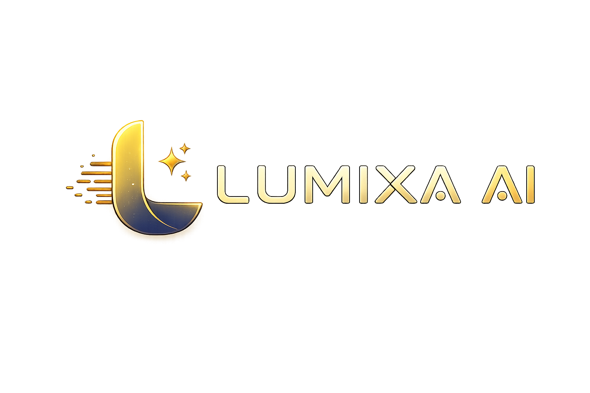

<p align="center">
  
</p>

<p align="center">
An AI-Powered Knowledge Assistant
</p>

<p align="center">
  
  
  
  
  
  
</p>


<p align="center">🚀 https://lumixa-ai.streamlit.app</p>

---
# 📖 About

LUMIXA AI is an AI-powered Knowledge Assistant , designed to transform information from multiple sources into an intelligent, searchable knowledge base using Retrieval-Augmented Generation (RAG).

The application enables users to upload **YouTube videos, PDF documents, websites, and plain text**, then interact with their knowledge through AI-powered summaries, contextual conversations, and semantic search.

Instead of relying solely on Large Language Models, LUMIXA AI retrieves the most relevant information from a custom knowledge base before generating responses, improving accuracy and reducing hallucinations.

Built with a modular architecture, the project demonstrates practical implementation of modern AI engineering concepts including semantic search, vector embeddings, context engineering, prompt engineering, and conversational memory.

---

# ✨ Features

## 📥 Multi-Source Knowledge Ingestion

Build an intelligent knowledge base from multiple sources.

- 🎥 Analyze YouTube videos
- 📄 Upload and chat with PDF documents
- 🌐 Extract knowledge from websites
- 📝 Add custom notes using plain text

---

## 🧠 AI-Powered Insights

Generate meaningful insights from your knowledge.

- Executive Summary
- Key Takeaways
- Main Topics
- AI-generated summaries

---

## 💬 AI Assistant

Interact naturally with your knowledge.

- Context-aware conversations
- Semantic search
- Streaming AI responses
- Conversation memory
- Follow-up questions

---

## 📚 Knowledge Base

Retrieve accurate information using Retrieval-Augmented Generation (RAG).

- Automatic document chunking
- Vector embeddings
- FAISS vector search
- Context builder
- Prompt builder
- Multi-source retrieval

---

## 📤 Export

- Download AI-generated PDF reports

# 🏗️ Architecture

<p align="center">
  
</p>

LUMIXA AI follows a modular Retrieval-Augmented Generation (RAG) architecture. Each component has a dedicated responsibility, making the application easier to maintain and extend.

# 🛠 Tech Stack

| Category | Technologies |
|----------|--------------|
| **Frontend** | Streamlit, HTML, CSS |
| **Programming Language** | Python |
| **Large Language Model** | Qwen 3 32B (OpenRouter) |
| **Embeddings** | Sentence Transformers (all-MiniLM-L6-v2) |
| **Vector Database** | FAISS |
| **Document Processing** | PyMuPDF |
| **Web Scraping** | BeautifulSoup4 |
| **YouTube Processing** | YouTube Transcript API |
| **PDF Reports** | ReportLab |
| **Deployment** | Streamlit Community Cloud |
| **Version Control** | Git, GitHub |

---

# 🧠 Skills Gained

Throughout the development of **LUMIXA AI**, the following AI engineering skills and concepts were implemented and practiced:

<p align="center">

<kbd>Retrieval-Augmented Generation (RAG)</kbd>
<kbd>Semantic Search</kbd>
<kbd>Vector Embeddings</kbd>
<kbd>FAISS Vector Database</kbd>


<kbd>Document Chunking</kbd>
<kbd>Context Engineering</kbd>
<kbd>Prompt Engineering</kbd>
<kbd>Knowledge Base Design</kbd>


<kbd>Retriever Pipeline</kbd>
<kbd>Conversation Memory</kbd>
<kbd>Metadata Management</kbd>
<kbd>Streaming LLM Responses</kbd>


<kbd>Sentence Transformers</kbd>
<kbd>OpenRouter API</kbd>
<kbd>Qwen LLM</kbd>
<kbd>AI Application Development</kbd>


<kbd>Multi-Source Knowledge Ingestion</kbd>
<kbd>PDF Processing</kbd>
<kbd>Website Content Extraction</kbd>
<kbd>YouTube Transcript Processing</kbd>

<kbd>Streamlit Development</kbd>
<kbd>Modular Architecture</kbd>
<kbd>Session State Management</kbd>
<kbd>AI System Design</kbd>

</p>

---

# ⚙️ Installation

### 1. Clone the Repository

```bash
git clone https://github.com/YOUR_USERNAME/LUMIXA-AI.git
cd LUMIXA-AI
```

### 2. Create a Virtual Environment

```bash
python -m venv venv
```

### 3. Activate the Virtual Environment

**Windows**

```bash
venv\Scripts\activate
```

**Linux / macOS**

```bash
source venv/bin/activate
```

### 4. Install Dependencies

```bash
pip install -r requirements.txt
```

### 5. Configure Environment Variables

Create a `.env` file in the project root.

```env
OPENROUTER_API_KEY=your_api_key
```

### 6. Run the Application

```bash
streamlit run app.py
```

The application will be available at:

```
http://localhost:8501
```

---

# # 🚀 Usage

<table>
<tr>
<td width="25%" valign="top">

### 🎥 YouTube

1. Paste a YouTube URL.
2. Click **Analyze Video**.
3. Generate AI summary.
4. Chat with the video.


</td>

<td width="25%" valign="top">

### 📄 PDF

1. Upload PDF's.
2. Process the documents.
3. Ask questions.
4. Export AI report.

</td>

<td width="25%" valign="top">

### 🌐 Website

1. Enter a website URL.
2. Extract webpage content.
3. Build knowledge base.
4. Chat with the content.

</td>

<td width="25%" valign="top">

### 📝 Plain Text

1. Paste custom text.
2. Add it to the knowledge base.
3. Ask questions.
4. Retrieve information.

</td>
</tr>
</table>

---


# 🧠 AI Engineering Concepts

LUMIXA AI was built to understand the core concepts behind modern AI-powered knowledge systems.

The project demonstrates practical implementation of:

- Retrieval-Augmented Generation (RAG)
- Semantic Search
- Multi-Source Knowledge Ingestion
- Document Chunking
- Vector Embeddings
- FAISS Vector Database
- Context Engineering
- Prompt Engineering
- Conversational Memory
- Knowledge Base Management
- Streaming LLM Responses
- Modular AI Architecture

---

# 👨‍💻 Author

**MUNAGALA SAI HANISH**

B.Tech Computer Science Engineering Student
JNTUH University, Hyderabad

Aspiring AI Engineer passionate about building production-ready AI systems and mastering AI Engineering through hands-on projects.

- 🌐 Live Demo: https://lumixa-ai.streamlit.app/
- 💻 GitHub: https://github.com/YOUR_USERNAME

---

# ⭐ Support

If you found this project useful, consider giving it a ⭐ on GitHub.
